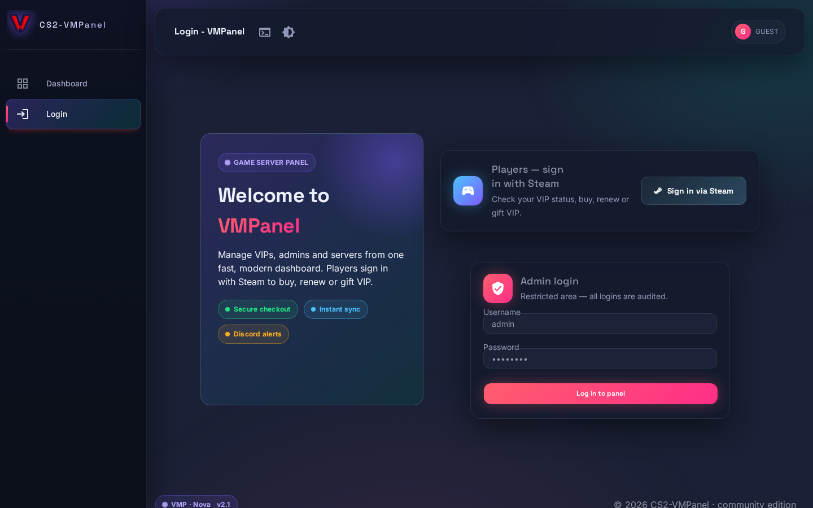
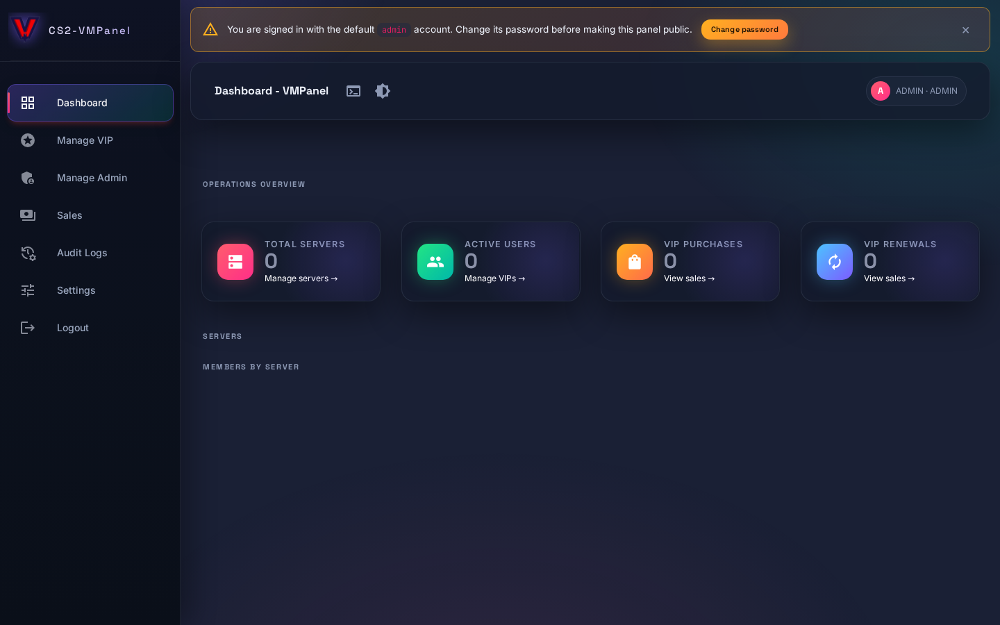
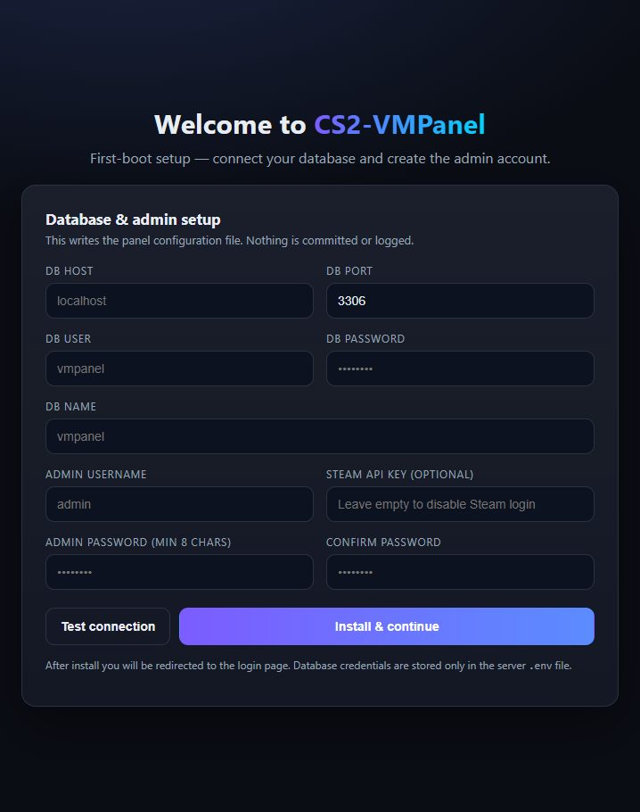
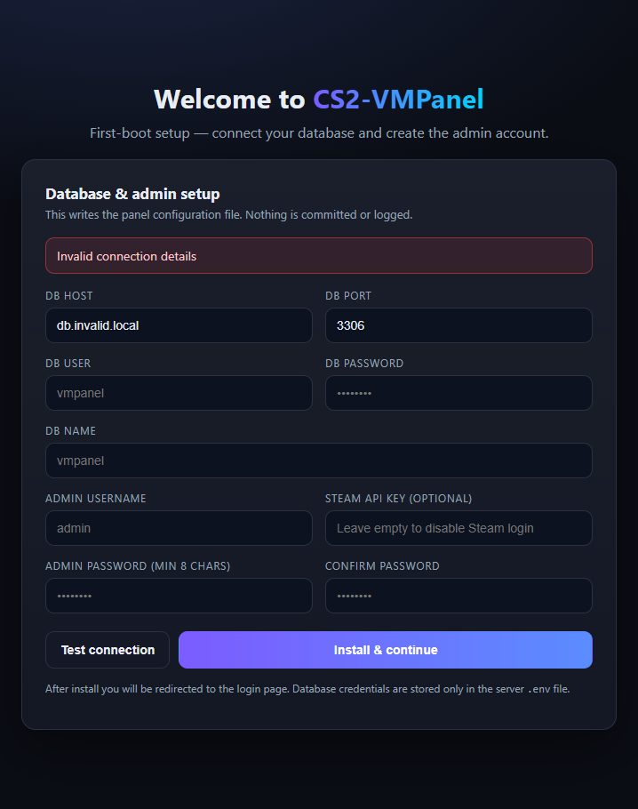

# CS2-VMPanel

Modern VIP & admin management panel for community game servers — dashboard, servers, VIPs, admins, bundles, Steam-player store with PayPal / PayU / Razorpay checkout, VIP gifting, Discord notifications, audit logs, and automatic VIP expiry.




> **Fork note:** this project is a modernized fork of [Summer-16/CSGO-VMPanel](https://github.com/Summer-16/CSGO-VMPanel) by Shivam Parashar (Summer Soldier), resecured and rebuilt (see [Credits](#credits)). The legacy `Server_Plugin/` (CS:GO SourceMod) and `Old_Content/` folders were removed in this fork — the panel manages all records in MySQL; point your game-server integration at the same database (schema in `app/db/migrations/`).

## Features

- **Dashboard** — servers, active VIPs/admins, sales & renewal counts, per-server VIP tables with expiry badges
- **VIPs** — add / extend / delete per server, Steam profile lookup, search, bulk-aware forms
- **Admins** — SourceMod flag management per server
- **Servers & bundles** — multi-server VIP packages, slot/pricing/flag control
- **Player store** — Steam login, owned-VIP status, buy/renew via PayPal, PayU, or Razorpay
- **VIP gifting** — gift to another user by Steam profile link with server-verified receiver preview
- **Payments** — server-side price/quote verification, order-replay protection, sale types (buy/renew/gift)
- **Discord** — sale notifications + scheduled VIP/admin listing digests
- **Audit logs & sales records** — super-admin only, paginated, quick-find filters
- **Automation** — cron expiry cleanup + Discord digests, one-click manual refresh
- **Security** — parameterized queries, transactional multi-server writes, CSRF tokens, RBAC-gated routes, rate-limited auth/payments, hardened sessions/cookies, safe error envelopes with request IDs, first-boot installer (no shipped credentials)
- **UI** — dark/light modes, 5 panel themes, responsive mobile drawer, command palette (`Ctrl/⌘+K`), keyboard-first, reduced-motion support

More screenshots: [`Screen_Shots/`](Screen_Shots/) (VIP management · settings · sales · mobile).

## Requirements

- Node.js 22+ (`engines` enforced)
- MySQL 8.0+ or MariaDB 10.6+
- Steam API key for player login ([get one](https://steamcommunity.com/dev))
- Optional: PayPal client ID, PayU merchant key/salt, Razorpay key ID/secret, Discord webhook URL

## Quick start — local

```bash
# 1. Database
sudo apt install mariadb-server mariadb-client
sudo service mariadb start
sudo mysql -e "CREATE DATABASE vmpanel CHARACTER SET utf8mb4 COLLATE utf8mb4_unicode_ci;
  CREATE USER 'vmpanel'@'localhost' IDENTIFIED BY 'pick-a-strong-password';
  GRANT ALL ON vmpanel.* TO 'vmpanel'@'localhost';"

# 2. Panel
npm install
cp .env.example .env   # optional — skip this and the wizard below creates .env for you
npm run migrate        # apply schema migrations (indexes, gifting columns; no-ops until setup is complete)
npm test               # smoke tests, no DB needed
node server.js         # http://localhost:3535 → redirects to the /install wizard on first boot
```

Default login is the admin account you create in the first-boot wizard below — there are no shipped credentials.

## Quick start — Docker (external MySQL, no bundled database)

The compose stack runs only the panel container using the prebuilt image from
GHCR (published by [`.github/workflows/docker-build.yml`](.github/workflows/docker-build.yml)
on every `main` push: `latest`, `main`, `sha-*`, plus `v*` version tags).
Provision MySQL/MariaDB yourself (any host reachable from the container:
managed DB, host package, or a separate container on your own network).

```bash
docker compose pull            # prebuilt ghcr.io/shaikhnedab/cs2-vmpanel:latest
docker compose up -d
docker compose logs -f panel
# → http://localhost:3535 (first visit redirects to the /install wizard)
```

Pin a version with `IMAGE_TAG` (e.g. `IMAGE_TAG=v2.0.0 docker compose up -d`).
Prefer building locally? Comment `image:` in `docker-compose.yml`, uncomment
`build: .`, then `docker compose up -d --build`. Either way you can skip
`.env` entirely — the wizard writes it on first boot, and the
`./.env:/app/.env` volume mount keeps it across restarts and rebuilds.

Container crash-looping? Pull fresh and recreate (stale images are the usual
cause — `up` alone never re-pulls):

```bash
docker compose pull && docker compose up -d --force-recreate
docker compose logs -f panel
```

## Install guide (first boot)

Provision MySQL 8.0+ / MariaDB 10.6+ first and create an empty database plus a
user with full rights on it (see [Quick start — local](#quick-start--local)
for the SQL, or use your hoster's panel). The DB user needs `CREATE`/`ALTER`
rights on first run (tables + migrations); plain read/write is enough after.

Start the panel with **no `.env`** (or `SETUP_COMPLETE=false`):



1. Open `/install` — every other page redirects there until setup finishes.
2. Fill DB host/port/user/password/name and press **Test connection**
   (5s timeout; failures show a red banner with a generic message —
   no driver details leak):

   

3. Pick the super-admin username (3–32 chars) + password (min 8 chars,
   confirmed), add an optional Steam API key, and optionally the panel's
   public address (used for Steam login callbacks — leave empty to
   auto-detect), then press **Install & continue**.
4. The panel re-tests the connection, writes `.env` (mode `0600`),
   creates tables, runs migrations, creates the super-admin (bcrypt cost 12),
   flips `SETUP_COMPLETE=true`, and redirects to `/login`. The container
   entrypoint owns the mounted `.env` to the app user automatically, so no
   manual `chown` is needed on first boot.

After setup `/install*` returns `404` and never reopens — even if the
database later goes down (those requests fail with a generic error instead).
To re-run setup: stop the panel, delete `.env`, start again.

> Back up `.env` — it holds your DB password and signing secrets. It is
> gitignored and never committed. `npm run migrate` stays idempotent and
> no-ops (exit 0) until setup is complete.

### Game server refresh (RCON)

VIP/admin changes push an RCON refresh to every game server automatically
(`MANUAL REFRESH` replays it on demand). The default command is
`css_viprefresh`; per server you can override it in Panel Settings → server
forms — e.g. `sm_vipRefresh` for classic SourceMod servers.
Empty means the default. Only letters, numbers, underscore and spaces
(max 100 chars) are accepted. The game-query probe is best-effort only: if a
server ignores UDP queries the panel still attempts RCON, and an RCON failure
never rolls back the VIP/admin database write (the toast reports it instead).

Images are also built in CI: see [`.github/workflows/docker-build.yml`](.github/workflows/docker-build.yml) (publishes to GHCR on `main`/tags).

### Payments — PayPal, PayU, Razorpay

The store shows a gateway button only when it is configured, and amounts are
re-checked server-side (price, currency, signature where applicable) before
any VIP is granted. Prices come from each server's VIP Price / bundle.

First: Panel Settings → set **Platform Currency** (`USD` or `INR`).
PayU and Razorpay buttons appear only for `INR`; PayPal appears whenever its
Client ID is set (charged in the platform currency).

#### PayPal (any currency; typical for USD)

1. https://developer.paypal.com → Dashboard → Apps & Credentials → create a
   REST app. Sandbox app = test money, Live app = real money.
2. Copy the **Client ID** (single variable — no secret needed panel-side).
3. `.env`: `PAYPAL_CLIENT_ID=<id>`, recreate the container, open the store.
4. Test with a PayPal sandbox buyer; go live by swapping in the Live Client ID.

#### PayU (INR only)

1. PayU merchant dashboard → API access → copy the Test **Key** + **Salt**
   (keep them paired — a test Key with a live Salt fails the hash check).
2. `.env`: `PAYU_ENABLED=true`, `PAYU_ENV=test`, `PAYU_MERCHANT_KEY=…`,
   `PAYU_MERCHANT_SALT=…`; Platform Currency must be `INR`.
3. Test with PayU's test cards — the checkout opens purple (test) vs green (live).
4. Go live: `PAYU_ENV=live` plus the Live Key + Salt.
Note: PayU return URLs follow `PUBLIC_BASE_URL` when set, else the address
the buyer used (https-aware behind a proxy) — the panel must be publicly
reachable or test payments cannot return.

#### Razorpay (INR only)

1. Razorpay Dashboard → Settings → API Keys → generate a **Test** pair
   (`rzp_test_…` ID + secret).
2. `.env`: `RAZORPAY_ENABLED=true`, `RAZORPAY_KEY_ID=…`,
   `RAZORPAY_KEY_SECRET=…`; currency `INR`. (`RAZORPAY_ENV` is accepted but
   test/live mode actually follows the key prefix.)
3. Test with Razorpay test cards/UPI — the panel verifies the payment
   signature server-side before granting VIP.
4. Go live: generate the **Live** pair (`rzp_live_…`) and swap both values.

After any `.env` change: `docker compose up -d --force-recreate`
(config loads at boot; plain `up` is not enough).

Troubleshooting: button missing → gateway enabled? (PayPal: Client ID
present?) currency match (PayU/Razorpay need `INR`)? container recreated
after the edit? Payment failing at checkout → wrong-mode credentials
(test key on live checkout or vice versa).

### Environment

| Variable | Required | Purpose |
|---|---|---|
| `DB_HOST` `DB_PORT` `DB_USER` `DB_PASSWORD` `DB_NAME` | yes | MySQL/MariaDB connection (external host — the compose stack bundles no database) |
| `JWT_SECRET` `APP_SESSION_SECRET` | yes | Auth/session signing (≥32 random chars) |
| `STEAM_API_KEY` | for player login | Steam Web API key |
| `HOSTNAME` `SERVER_PORT` `APACHE_PROXY` | behind proxy | `true` behind nginx/Apache (trusts `X-Forwarded-Proto`; cookies are `Secure` automatically on HTTPS). Direct `http://host:port` access also works — cookies stay non-`Secure` there so sessions persist |
| `PUBLIC_BASE_URL` | no | Canonical public address for Steam login callbacks (e.g. `https://vip.example.com`). Asked by the install wizard; empty = auto-detect from each request |
| `PAYPAL_CLIENT_ID` | for PayPal | PayPal REST client ID |
| `PAYU_ENABLED` `PAYU_ENV` `PAYU_MERCHANT_KEY` `PAYU_MERCHANT_SALT` | for PayU | PayU gateway |
| `RAZORPAY_ENABLED` `RAZORPAY_ENV` `RAZORPAY_KEY_ID` `RAZORPAY_KEY_SECRET` | for Razorpay | Razorpay gateway |
| `SCHEDULE_DELETE_HOURS` `SCHEDULE_NOTIF_HOURS` | no | Cron intervals for expiry cleanup / Discord digests |
| `LOG_LEVEL` | no | `INFO` (production) / `DEBUG` (request logging) |

Never commit `.env` or `config.json` — both are gitignored.

## Reverse proxy hosting

TLS should terminate at the proxy; always run the panel with `APACHE_PROXY=true` behind one.

**nginx** — [`deploy/nginx-vmPanel.conf`](deploy/nginx-vmPanel.conf) (validated with `nginx -t`):

```bash
sudo cp deploy/nginx-vmPanel.conf /etc/nginx/sites-available/vmpanel
sudo ln -s /etc/nginx/sites-available/vmpanel /etc/nginx/sites-enabled/
# add the limit_req_zone line to the http{} block (see comments in the file)
sudo certbot --nginx -d vip.example.com
sudo nginx -t && sudo systemctl reload nginx
```

**Apache** — [`deploy/apache-vmPanel.conf`](deploy/apache-vmPanel.conf):

```bash
sudo a2enmod proxy proxy_http headers rewrite ssl
sudo cp deploy/apache-vmPanel.conf /etc/apache2/sites-available/vmpanel.conf
sudo a2ensite vmpanel && sudo apache2ctl configtest && sudo systemctl reload apache2
```

## Docs & internals

- `app/db/migrations/` — versioned schema changes (`npm run migrate` is idempotent; it no-ops with exit 0 until setup is complete)
- `tests/smoke.js` + `tests/install.js` — `npm test`

## Credits

CS2-VMPanel is a fork of **[CSGO-VMPanel](https://github.com/Summer-16/CSGO-VMPanel)** by **Shivam Parashar (Summer Soldier)**, which created the original panel, plugin, and feature set. This fork modernized it: full security overhaul, hardened payments, VIP gifting, new Nova UI with dark/light modes, Docker support, and migrations — while keeping the plugin database contract intact. Licensed under [GPL-3.0-or-later](LICENSE), same as upstream.
