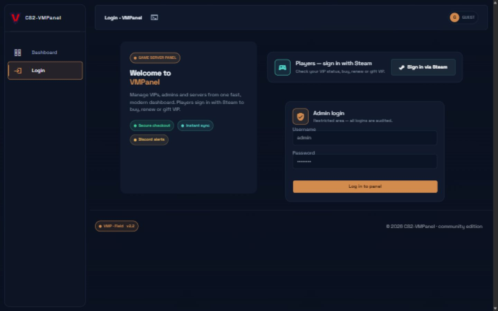
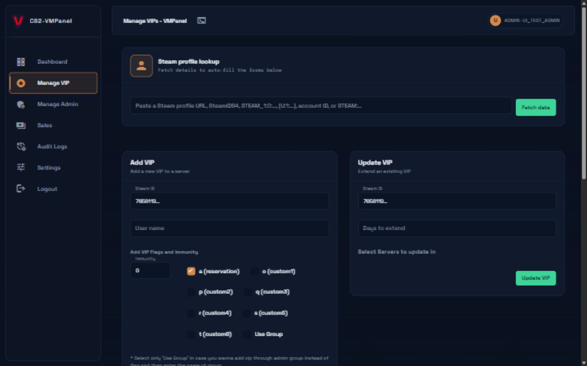
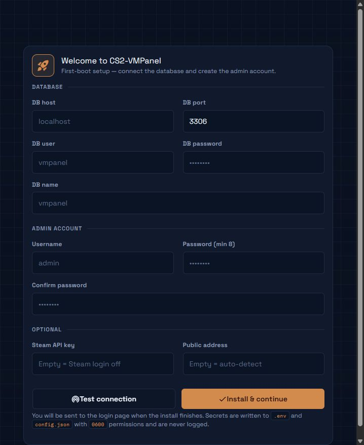
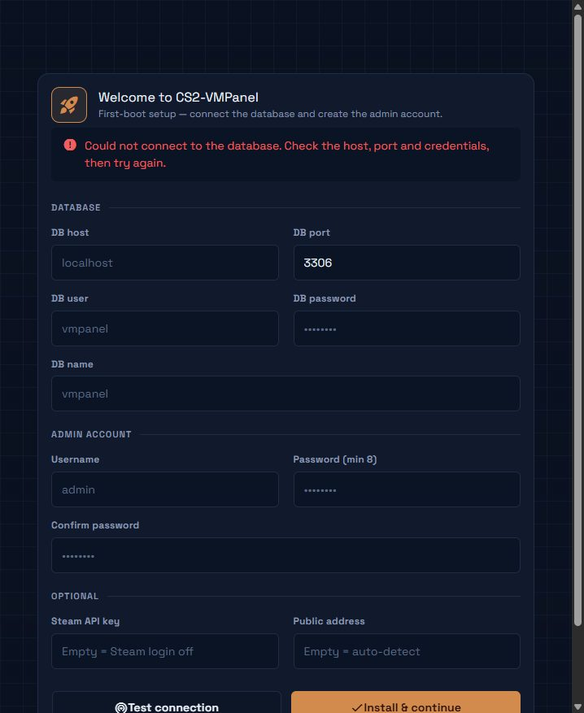

# CS2-VMPanel

VIP and admin management for CS2 community servers — a panel for servers, VIPs, admins and
bundles, plus a Steam-login store with PayPal / PayU / Razorpay checkout, VIP gifting, Discord
notifications, audit logs and automatic VIP expiry.




> **Fork note.** A modernized fork of [Summer-16/CSGO-VMPanel](https://github.com/Summer-16/CSGO-VMPanel)
> by Shivam Parashar (Summer Soldier) — see [Credits](#credits). The legacy `Server_Plugin/`
> (CS:GO SourceMod) and `Old_Content/` folders are gone: the panel owns all records in MySQL, so
> point your game-server integration at the same database (schema in `app/db/migrations/`).

## Features

- **Dashboard** — server, VIP, admin and sales counters with per-server breakdowns
- **VIPs** — add, extend, delete per server, with bulk forms and a Steam profile lookup
- **Admins** — SourceMod flag management per server (`a`–`z` plus custom groups)
- **Servers & bundles** — multi-server VIP packages with slot, pricing and flag control
- **Player store** — Steam login, owned-VIP status, buy or renew through PayPal, PayU or Razorpay
- **VIP gifting** — gift a purchase to another account behind a server-verified receiver check
- **Payments** — server-side price and signature re-verification, replay protection, buy/renew/gift order types
- **Discord** — sale notifications plus scheduled VIP/admin listing digests
- **Audit logs & sales records** — super-admin only, paginated, quick-find filters
- **Automation** — cron expiry cleanup, Discord digests, one-click RCON refresh
- **Security** — parameterized queries, transactional multi-server writes, CSRF tokens, RBAC-gated
  routes, rate-limited auth and payments, hardened sessions, safe error envelopes with request IDs,
  and a first-boot installer that ships no credentials
- **UI** — one fixed field-instrument theme (navy, copper, cyan), responsive down to phone width,
  command palette (`Ctrl`/`⌘` + `K`), keyboard-first, reduced-motion aware

## Requirements

- Node.js 22+ (`engines` is enforced)
- MySQL 8.0+ or MariaDB 10.6+
- A Steam Web API key for player login — [get one](https://steamcommunity.com/dev)
- Optional: PayPal client ID, PayU merchant key/salt, Razorpay key ID/secret, Discord webhook URL

## Quick start — local

```bash
# 1. Database
sudo apt install mariadb-server mariadb-client
sudo service mariadb start
sudo mysql -e "CREATE DATABASE vmpanel CHARACTER SET utf8mb4 COLLATE utf8mb4_unicode_ci;
  CREATE USER 'vmpanel'@'localhost' IDENTIFIED BY 'pick-a-strong-password';
  GRANT ALL ON vmpanel.* TO 'vmpanel'@'localhost';"

# 2. Panel
npm install
npm test      # 108 tests, no database needed
npm start     # http://localhost:3535 → redirects to /install on first boot
```

The wizard writes `app/config/config.json` (mode `0600`) with your DB credentials, signing secrets
and Steam key. There are no shipped credentials — the first admin is the one you create in the
wizard. A legacy `.env` is still read if present, and anything in it overrides `config.json`.

## Quick start — Docker

The compose stack runs the panel only; it uses the prebuilt image from GHCR, published by
[`.github/workflows/docker-build.yml`](.github/workflows/docker-build.yml) on every push to `main`
(tags: `latest`, `main`, `sha-*`, `v*`). Provide your own MySQL/MariaDB — anything reachable from the
container: a managed instance, a host package, or a separate container on your network.

```bash
cp app/config/example_config.json config.json   # bind mount needs the file to exist first
docker compose pull                             # ghcr.io/shaikhnedab/cs2-vmpanel:latest
docker compose up -d
docker compose logs -f panel
# → http://localhost:3535 (first visit redirects to /install)
```

Pin a release with `IMAGE_TAG` (`IMAGE_TAG=v2.0.0 docker compose up -d`), or build locally by
commenting the `image:` line, uncommenting `build: .` and running `docker compose up -d --build`.
The wizard fills in the mounted `config.json`, which survives restarts and rebuilds.

Troubleshooting:

| Symptom | Cause | Fix |
|---|---|---|
| `config.json` is a **folder** on the host | Docker created a directory because the file was missing at first `up` | `docker compose down && rmdir config.json && cp app/config/example_config.json config.json && docker compose up -d` |
| Crash-looping container | Stale image — `up` never re-pulls | `docker compose pull && docker compose up -d --force-recreate` |
| Config edit had no effect | Config is read at boot | `docker compose up -d --force-recreate` |

## First boot

Provision the database first, with a user that has `CREATE`/`ALTER` rights on first run (plain
read/write is enough afterwards). Then start the panel with **no `config.json`** — or with
`"setupComplete": false` — and every route redirects to `/install` until setup finishes.



1. Fill in DB host, port, user, password and name, then press **Test connection** (5s timeout).
2. Choose the super-admin username (3–32 chars) and password (min 8, confirmed).
3. Optionally add a Steam API key and the panel's public address. The public address is used for
   Steam login callbacks — leave it empty to auto-detect from each request.
4. Press **Install & continue**. The panel re-tests the connection, writes `config.json` (mode
   `0600`), creates the tables, runs migrations, creates the super-admin (bcrypt cost 12), sets
   `"setup_complete": true` and redirects to `/login`. The entrypoint hands the mounted
   `config.json` to the app user, so no manual `chown` is needed.

Connection failures come back as a plain message with no driver details leaked:



After setup, `/install*` returns `404` and never reopens — even if the database later goes down, in
which case those requests fail with a generic error instead. To re-run setup: stop the panel, delete
`config.json`, start again.

> Back up `config.json` — it holds your DB password and signing secrets. It is gitignored and never
> committed. `npm run migrate` stays idempotent and no-ops (exit 0) until setup completes.

### Steam ID lookup

The lookup box on **Manage VIP** and the receiver box on the gift flow both accept any of these, and
resolve them to one canonical SteamID64 before anything is stored:

| Input | Example |
|---|---|
| Profile URL | `https://steamcommunity.com/id/shaikhnedab/` |
| SteamID | `STEAM_1:0:65879019` |
| SteamID64 | `76561198092023766` |
| SteamID3 | `[U:1:131758038]` |
| Account ID | `131758038` |
| Steam / FiveM hex | `STEAM:110000107DA77D6`, `0x110000107DA77D6` |

Anything unrecognised is rejected before it reaches the database, and the resolved ID comes from
Steam, never from the pasted text.

### Game server refresh (RCON)

VIP and admin changes push an RCON refresh to every server automatically. The default command is
`css_viprefresh`; override it per server in Panel Settings (e.g. `sm_vipRefresh` for classic
SourceMod). Empty means the default, and only letters, numbers, underscore and spaces (max 100
chars) are accepted. **Refresh all servers** in Panel Settings replays it on demand.

The game-query probe is best-effort: if a server ignores UDP queries the panel still attempts RCON,
and an RCON failure never rolls back the VIP/admin database write — the toast reports it instead.

### Payments — PayPal, PayU, Razorpay

A gateway button only appears once that gateway is configured, and every amount is re-checked
server-side (price, currency, signature where applicable) before a VIP is granted. Prices come from
each server's VIP price or bundle.

Set **Platform Currency** (`USD` or `INR`) in Panel Settings first. PayU and Razorpay require `INR`;
PayPal works in any currency as long as its Client ID is set. VIP gifting is on by default — set
`GIFTING_ENABLED=false` (or `"gifting": { "enabled": false }` in `config.json`) to remove the gift
option and refuse gift purchases.

**PayPal** — [developer.paypal.com](https://developer.paypal.com) → Dashboard → Apps & Credentials →
create a REST app (sandbox = test money, live = real money). Copy the **Client ID** into
`config.json` → `payment_gateways.paypal.paypal_client_id` (or the `PAYPAL_CLIENT_ID` env var,
which wins), recreate the container, and test with a sandbox buyer before swapping in the live ID.

**PayU** (INR only) — copy the **paired** Test Key + Salt from the PayU dashboard (a test key with a
live salt fails the hash check) into `config.json` → `payment_gateways.payU` with
`"environment": "test"`, or use the `PAYU_*` env vars. Checkout opens purple in test and green in
live; go live with `PAYU_ENV=live` plus the live pair.

**Razorpay** (INR only) — generate a **Test** pair (`rzp_test_…`) in Dashboard → Settings → API Keys
into `config.json` → `payment_gateways.razorPay`. Test mode follows the key prefix, not
`RAZORPAY_ENV`. Go live by swapping in the `rzp_live_…` pair.

Return URLs follow `PUBLIC_BASE_URL` when set, otherwise the address the buyer used (HTTPS-aware
behind a proxy) — so the panel must be publicly reachable or test payments cannot return.

| Symptom | Check |
|---|---|
| Button missing | Gateway enabled? PayPal Client ID present? Currency matches (`INR` for PayU/Razorpay)? Container recreated after the edit? |
| Checkout fails | Wrong-mode credentials — a test key on live checkout, or vice versa |

## Environment

Every value can live in `config.json`; the matching environment variable always wins.

| Variable | Required | Purpose |
|---|---|---|
| `DB_HOST` `DB_PORT` `DB_USER` `DB_PASSWORD` `DB_NAME` | yes | MySQL/MariaDB connection (external — the compose stack bundles no database) |
| `JWT_SECRET` `APP_SESSION_SECRET` | yes | Auth/session signing, ≥32 random characters |
| `STEAM_API_KEY` | for player login | Steam Web API key |
| `PORT` `SERVER_PORT` | no | Listen port (default `3535`); `docker-compose.yml` also maps the host port from `SERVER_PORT` |
| `HOSTNAME` | no | Bind address (default `localhost`) |
| `APACHE_PROXY` | behind a proxy | `true` trusts `X-Forwarded-Proto` and marks cookies `Secure` on HTTPS. Direct `http://host:port` access also works — cookies stay non-`Secure` there so sessions persist |
| `PUBLIC_BASE_URL` | no | Canonical public address for Steam login callbacks. Asked by the wizard; empty = auto-detect per request |
| `CONFIG_PATH` | no | Config file location (default `app/config/config.json`) |
| `GIFTING_ENABLED` | no | `false` disables VIP gifting (default `true`) |
| `PAYPAL_CLIENT_ID` | for PayPal | PayPal REST client ID |
| `PAYU_ENABLED` `PAYU_ENV` `PAYU_MERCHANT_KEY` `PAYU_MERCHANT_SALT` | for PayU | PayU gateway |
| `RAZORPAY_ENABLED` `RAZORPAY_ENV` `RAZORPAY_KEY_ID` `RAZORPAY_KEY_SECRET` | for Razorpay | Razorpay gateway |
| `SCHEDULE_DELETE_HOURS` `SCHEDULE_NOTIF_HOURS` | no | Cron intervals for expiry cleanup / Discord digests |
| `LOG_LEVEL` | no | `INFO` (default) or `DEBUG` (per-request logging) |

Never commit `.env` or `config.json` — both are gitignored.

`GET /healthz` is always open (including mid-install) and returns `{"ok":true}` — use it for
container health checks and uptime probes.

## Reverse proxy

Terminate TLS at the proxy and always run the panel with `APACHE_PROXY=true` behind one.

**nginx** — [`deploy/nginx-vmPanel.conf`](deploy/nginx-vmPanel.conf), validated with `nginx -t`:

```bash
sudo cp deploy/nginx-vmPanel.conf /etc/nginx/sites-available/vmpanel
sudo ln -s /etc/nginx/sites-available/vmpanel /etc/nginx/sites-enabled/
# add the limit_req_zone line to the http{} block (see comments in the file)
sudo certbot --nginx -d vip.example.com
sudo nginx -t && sudo systemctl reload nginx
```

**Apache** — [`deploy/apache-vmPanel.conf`](deploy/apache-vmPanel.conf):

```bash
sudo a2enmod proxy proxy_http headers rewrite ssl
sudo cp deploy/apache-vmPanel.conf /etc/apache2/sites-available/vmpanel.conf
sudo a2ensite vmpanel && sudo apache2ctl configtest && sudo systemctl reload apache
```

## Layout

```
app/
  config/          config.json loader (env always wins)
  controllers/     request handlers
  db/migrations/   versioned schema (npm run migrate, idempotent)
  models/          data access
  routes/          router + first-boot installer
  utils/           Steam ID math, URL/secret helpers
public/css/        nova-tokens.css (tokens) + vmp-design-system.css (components)
views/             EJS templates
tests/             smoke.js (no DB) + install.js
```

Run the suite with `npm test`. It needs no database, and the expected DB/RCON errors it logs are
deliberate fixtures proving the error paths stay masked.

## Credits

CS2-VMPanel is a fork of **[CSGO-VMPanel](https://github.com/Summer-16/CSGO-VMPanel)** by **Shivam
Parashar (Summer Soldier)**, which created the original panel, plugin and feature set. This fork
modernized it: security overhaul, hardened payments, VIP gifting, the field-instrument UI, Docker
support and migrations — while keeping the plugin's database contract intact. Licensed under
[GPL-3.0-or-later](LICENSE), same as upstream.
